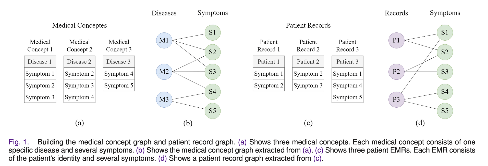
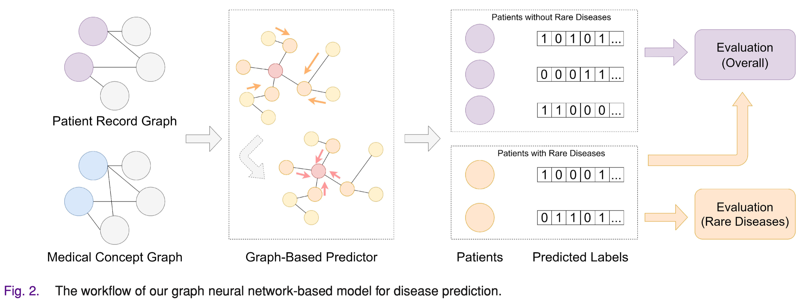

# CS598DL4H_DPviaGNN


This is the final project for CS598 Deep Learning for Healthcare. In this project, we try to reproduce the paper [Disease Prediction via Graph Neural Networks](https://ieeexplore.ieee.org/document/9122573). This repository is adapted on the basis of the [official repository](https://github.com/zhchs/Disease-Prediction-via-GCN).


## Requirement
```
python >=3.8
pytorch
numpy
sklearn
```

## data format
```shell script
"filename.nodes.pkl"
# list of node: [node1(str), node2(str), node3(str), ...]

"filename.adj.pkl"
# adj list of nodes: 
# {node1(str): [neighbor1(str), neighbor2(str), ...], node2: []...}

"filename.rare.label.pkl"
# rare flag, indicating whether a node is a rare disease (value=1) 
# or contains a rare disease, NumPy array of shape (N * 1) 

"filename.label.pkl"
# NumPy array of shape (N * D), N is node number 
# and D is the number of diseases

"filename.map.pkl"
# mapping node to index, {node(str): node_id(int), ...}

"filename.train.pkl"
# list of nodes for training, [node_idx_1(int), node_idx_2(int), ....]

"filename.test.pkl"
# list of nodes for testing, [node_idx_1(int), node_idx_2(int), ....]
```
## Build the medical concept graph and patient record graph


## Workflow

## Hyperparameters 
```
Hyper-parameter can be changed in run_multi.py
Best result's hyper-parameter
    Initialization embedding dimension = 10000
    Output embedding dimension = 1000
    Aggregator layer size = 1
    Top-k diseases = 2
    Number of epochs = 8000
    Learning rate = 0.3
    Batch-size =  200 
    
Other result's hyper-parameter
    Initialization embedding dimension = \{500, 1000, 2000, 4000, 6000, 8000, 10000\}
    Output embedding dimension = \{50, 100, 200, 400, 600, 800, 1000\}
    Aggregator layer size = \{1, 2, 3, 4\}
    Top-k diseases = \{2, 3, 5\}
    Number of epochs = 8000
    Learning rate = 0.3
    Batch-size =  200 
```
## Run Model
```shell script
python run_multi.py
```

## References

```tex
@article{sun2020disease,
  title={Disease prediction via graph neural networks},
  author={Sun, Zhenchao and Yin, Hongzhi and Chen, Hongxu and Chen, Tong and Cui, Lizhen and Yang, Fan},
  journal={IEEE Journal of Biomedical and Health Informatics},
  volume={25},
  number={3},
  pages={818--826},
  year={2020},
  publisher={IEEE}
}
```
